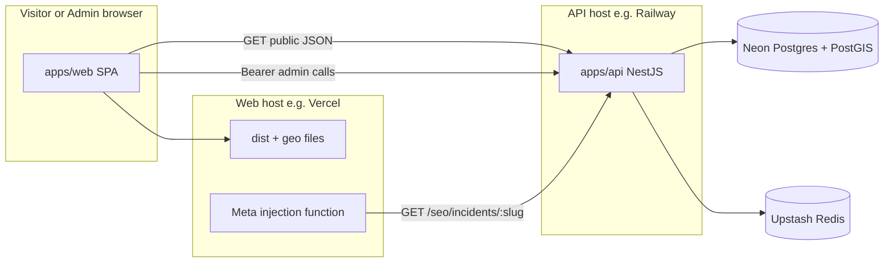
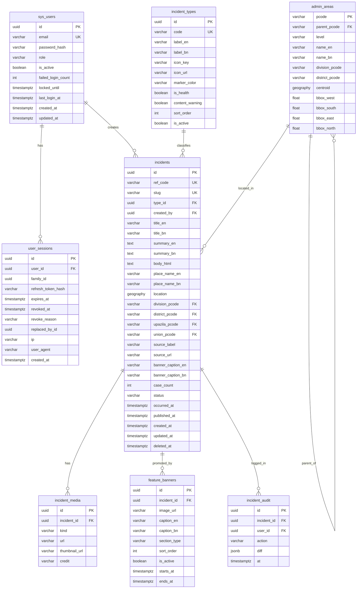

# LashKoi Incident Map — Requirements, Architecture, API & Build Plan

This is the single source of truth for building LashKoi. A developer should be able to build from it; the product owner should be able to read it and know the end result. Anything marked **DECISION** can be changed in section 3 before Phase 1 starts.

Contents:

1. Product summary and end result
2. Requirement analysis (personas, functional, non-functional, out of scope, risks)
3. Open decisions (change requirements here)
4. Review of the previous plan — problems found and improvements
5. System architecture
6. Database schema v2
7. API documentation (every endpoint)
8. Frontend architecture
9. Frontend-to-backend handshake (how the dots connect)
10. UX specifications (splash, map, overlay, storyteller, banner)
11. SEO specification
12. Security, privacy, legal
13. Phases 0–5 in detail
14. Environments, deployment, local dev
15. Reuse from existing LashKoi assets
16. Future: procedural Three.js + GSAP intro (not MVP)

---

## 1. Product summary and end result

**What LashKoi is**: a public, read-only interactive map of Bangladesh that shows reported incidents (extortion, measles, kidnap, dengue) at their location, with news source, date, photo/video, and description. Only the admin can add or publish incidents.

**What a visitor sees (end result)**:

- Opens the site: a **simple loading screen** (CSS + minimal JS) — dark background, LashKoi branding, spinner or progress bar, status text such as "Loading incident data…" — visible **for as long as critical API calls take** (with a sensible max timeout). No video, no Three.js in MVP.
- When data is ready, **"ENTER INTERACTIVE MAP"** enables (or the map auto-opens after a short delay — see D7). A red **blood-flow** transition reveals the dark Bangladesh map (divisions and districts outlined). *(A cinematic 3D intro is planned for a later phase — section 16.)*
- Header: LashKoi logo, incident-type selector (Extortion / Measles / Kidnap / Dengue / All), division filter, search box, EN/BN language toggle, play/pause for storyteller.
- Markers appear across the country; each incident type has its own icon and color.
- Storyteller mode starts automatically: the map flies to today's latest incident, the right-side overlay shows its details; every 20 seconds it moves to the next incident of the same day, then the previous day, and so on backward.
- The overlay shows: source badge, place, headline, date, image/YouTube/Facebook tabs, a feature banner caption on the image, short description, "Read full report" and "Recenter map".
- Clicking any marker pauses storyteller and opens that incident.
- Each incident has a shareable page `/{en|bn}/incidents/{slug}` with a proper link preview on Facebook/WhatsApp/X.

**What the admin sees (end result)**:

- `/admin/login` → email + password.
- Incident list with status (draft / published / archived), filters, search.
- Incident form: type, EN/BN headline, summary, full HTML body, source label and URL, date/time, division → district → upazila → union dropdowns (cascading), point picker on map, image / YouTube / Facebook URLs, banner caption, publish button.
- Featured banners management.
- Publishing makes the incident visible on the public map and in the sitemap within 1 minute.

---

## 2. Requirement analysis

### 2.1 Personas

- **Public visitor** (anonymous, mostly mobile, Bangladesh, Bangla-first). Wants to see what happened where, recently, and trust the source.
- **Admin** (one person initially, desktop). Enters and publishes incidents from news reports. Must be fast to enter and hard to make mistakes.
- **Partner site** (Phase 5, e.g. bdvote2026). Pulls a read-only JSON feed.

### 2.2 Functional requirements

Public map:

- **FR-01** Show a map of Bangladesh only, with division and district boundaries, without third-party tile API keys (see DECISION D4).
- **FR-02** Show published incidents as markers at their coordinates; icon and color depend on incident type.
- **FR-03** Incident-type selector: Extortion, Measles, Kidnap, Dengue, All. Changing it refetches and redraws markers.
- **FR-04** Division filter (8 divisions). Selecting a division zooms the map to it and filters markers.
- **FR-05** Text search over headline, summary, place name (server-side).
- **FR-06** Clicking a marker opens the floating overlay panel (not a Leaflet popup) and highlights the marker.
- **FR-07** Overlay shows source, place, headline, date, media tabs (only tabs that have a URL), banner caption, description, incident ref, recenter.
- **FR-08** "Read full report" shows sanitized HTML body (expand in panel, or navigate to the SEO page).
- **FR-09** Quick incident switcher (bottom-left list) for the current day/filter.
- **FR-10** EN/BN toggle for UI text and incident fields (falls back to EN when BN missing).
- **FR-11** Splash (MVP): **CssLoadingSplash** — fullscreen loading UI for the duration of critical API prefetch (section 10.1); optional per-type counts when `/stats/summary` returns; CTA when ready; skip link; then blood-flow transition. **Not in MVP:** Three.js intro (section 16).
- **FR-12** Storyteller (D6): **auto-play on first map load**; 20 s per incident; within each day **newest first**; then previous calendar days; max **30 days** back; **loop to today**; pauses per FR-13.
- **FR-13** Storyteller pauses on any user interaction (marker click, filter change, search, map drag); resume button in header.
- **FR-14** Feature banner: caption chip on the image stage when the incident has `bannerCaption` or an active feature banner linked to it.
- **FR-15** Shareable incident page per slug with meta tags, JSON-LD, and working social previews.
- **FR-16** `sitemap.xml` and `robots.txt` on the public web domain.

Geography API:

- **FR-20** Hierarchical boundary APIs: divisions → districts of a division → upazilas of a district → unions of an upazila.
- **FR-21** Every incident stores division, district, upazila, union P-codes (upazila/union optional).

Admin:

- **FR-30** Only admin accounts exist. No public registration.
- **FR-31** Login with email + password; access token (Bearer) + refresh token with rotation.
- **FR-32** Create, edit, publish, unpublish (archive), soft-delete incidents.
- **FR-33** Cascading geography selects and map point picker; picked point must be inside the selected district (server validates with PostGIS, DECISION D8).
- **FR-34** Media URLs (image, YouTube, Facebook) validated server-side.
- **FR-35** HTML body sanitized server-side on save.
- **FR-36** Slug auto-generated from EN headline, editable, unique.
- **FR-37** Manage featured banners (image, caption EN/BN, linked incident, schedule).
- **FR-38** Logout revokes the session; "logout everywhere" revokes all sessions.

### 2.3 Non-functional requirements

- **NFR-01 Performance**: map interactive (after splash) under 4 s on 4G mid-range Android; incident list API p95 under 300 ms for up to 2,000 points.
- **NFR-02 Payload**: GeoJSON list excludes `bodyHtml`; target under 300 KB gzipped for 2,000 points.
- **NFR-03 Availability**: public reads keep working if Redis is down (Redis is cache only, fail-open for cache, fail-closed only for login rate limit).
- **NFR-04 Security**: OWASP basics, Bearer JWT, refresh rotation with reuse detection, rate limiting, CORS allowlist, CSP, HTML sanitization on write and read.
- **NFR-05 Accessibility**: keyboard access to type selector, list, overlay; `prefers-reduced-motion` disables blood-flow and storyteller auto-fly animations.
- **NFR-06 i18n**: BN and EN; dates formatted in Asia/Dhaka.
- **NFR-07 SEO**: Lighthouse SEO ≥ 90 on incident pages; valid sitemap.
- **NFR-08 Observability**: structured logs (Pino, as scol), request id, health endpoint.
- **NFR-09 Cost**: free tiers at launch (Neon free, Upstash free, static web host), no paid map tiles.

### 2.4 Out of scope (MVP)

- Public incident submission, comments, likes, user accounts.
- Image upload/storage (admin pastes URLs; upload in a later phase).
- Push notifications, native apps.
- **Procedural Three.js + GSAP "Gotham city" intro** — documented in section 16; build after MVP map is live.
- The BDCP project — used only as an API-shape reference ([governance-tracker-api.md](E:\Project Next\BDCP\governance-tracker-api.md)); do not build it.

### 2.5 Assumptions

- Admin enters data manually from published news.
- Volume: tens of incidents per day, thousands per year.
- Web and API may be on **different subdomains** (D1: Bearer refresh in storage, CORS allowlist).

### 2.6 Risks

- **Legal/defamation**: extortion and kidnap reports name people. Mitigation: always store `sourceLabel` + `sourceUrl`, show "Allegation reported by {source}" wording, no victim names for kidnap of minors, takedown process.
- **Health data semantics**: dengue/measles are case counts, not single events. Mitigation: optional `caseCount` field now; district choropleth in Phase 5 (DECISION D5).
- **Slow API on first visit**: loading screen may sit several seconds. Mitigation: parallel prefetch, progress steps in UI, max wait then enter with retry banner (section 10.1).
- **Facebook embeds**: some videos block embedding. Mitigation: fallback "Watch on Facebook" link.
- **SEO on an SPA**: social crawlers do not run JavaScript. Mitigation: DECISION D2.

---

## 3. Open decisions (change requirements here)

**Locked defaults (product owner)** — change only by editing this section; implementation must match.

- **D1 Refresh token transport** — **LOCKED:** Refresh token sent in **`Authorization: Bearer <refresh_token>`** on `POST /admin/auth/refresh` and `POST /admin/auth/logout`. Client stores refresh token in **`sessionStorage`** (preferred) or **`localStorage`** (`lk_refresh_token`); access token in **memory** only (React state / module closure), never in localStorage. Login response returns `{ accessToken, refreshToken, expiresIn, user }` in envelope `data`. No httpOnly cookie for MVP. **Implication:** API and admin UI can live on different origins (e.g. `api.lashkoi.com` + `lashkoi.com`) with CORS allowlist only — no `credentials: 'include'` required.
- **D2 SEO rendering** — **LOCKED:** Lightweight **SPA** (Vite + React Router) plus **edge/server meta-injection** for `/:lang/incidents/:slug`. Edge function (Vercel/Cloudflare) fetches lightweight **`GET /api/v1/seo/incidents/:slug`**, injects `<title>`, `og:image`, `og:description`, canonical, `hreflang`, and **JSON-LD** into `index.html` before response. In-app navigation still uses `react-helmet-async` for consistency.
- **D3 Incident types** — Default: `extortion`, `measles`, `kidnap`, `dengue`, admin can add more later.
- **D4 Basemap** — **LOCKED:** **Offline / self-hosted dark vector map** — no third-party tile API. Dark canvas (`#0b0c10` / `slate-950`) plus **embedded simplified GeoJSON** for Bangladesh **division + district** polygons (from `public/geo/*.json`, derived from election / map-viewer assets). Optional upazila layer at high zoom (Phase 5). No Carto/Mapbox/Stadia in production.
- **D5 Health types display** — Default: dengue/measles as point markers with optional `caseCount`; district choropleth in Phase 5.
- **D6 Storyteller** — **LOCKED:** **Auto-play on first map load** after splash. Step through incidents **20 s** each: within a calendar day (Asia/Dhaka), order by **`occurredAt` descending** (newest first); when the day is exhausted, move to the **previous day** with incidents; repeat until **30 days** looked back, then **loop to today** (newest day) and continue. Pauses on user interaction (unchanged FR-13).
- **D7 Loading splash (MVP)** — **LOCKED:** **CssLoadingSplash** (logo + CSS spinner, no video/Three.js). **Phase 2** delivers the full public shell: splash is the **first Phase 2 milestone** (map + overlay follow in the same phase). Visible **while API prefetch runs** (duration = load time, no artificial minimum); safety **max 15 s** then enable CTA anyway. **`sessionStorage`**: show splash **once per browser session**; return visits in same tab skip to map (background prefetch). **Auto-enter map 12 s** after critical data finishes loading if user does not click. Persistent **"Skip to Map"** (top-right). Then blood-flow transition (section 10.1).
- **D7b 3D intro** — **Not MVP.** Section 16 only.
- **D8 Location validation** — Default: server rejects a point outside the selected district polygon. Alternative: warning only.
- **D9 Admin accounts** — Default: one admin seeded from env; more admins added by SQL/CLI only. Alternative: admin user management screen (Phase 3+).

---

## 4. Review of the previous plan — problems found and improvements

Problems found (fixed in this version):

- Sample JSON used type `vandalism`, which is not an MVP type — examples now use `extortion`.
- `division` was said to come from a `districts_ref` table that no longer exists — now from `admin_areas` via `division_pcode`.
- Division filter used names (`Dhaka`) — now P-codes (`BD30`) in the API, names only for display.
- Refresh token: **LOCKED** to Authorization header + sessionStorage (D1), not cookies.
- `react-helmet` alone does not produce social previews on an SPA — now D2.
- Prototype basemap (Carto) needs an API key — now D4, default to own GeoJSON basemap.
- Storyteller had no API support to find "previous day with incidents" — added `GET /incidents/days`.
- Response envelope was undocumented — scol's `ResponseInterceptor` wraps everything as `{ status, message, statusCode, data }`; now documented, with raw exceptions for `sitemap.xml` and `robots.txt`.
- scol cookie refresh pattern not used; LashKoi uses header refresh + CORS allowlist (D1).
- No pagination, limits, or error codes — added.
- Splash had no timeout — added max 10 s and error fallback.
- Tables-heavy, repeated sections — consolidated.

Improvements added:

- Requirement IDs (FR/NFR) so each phase maps to testable requirements.
- Full API reference with request/response examples and error codes.
- Frontend handshake section: env, api-client, envelope unwrap, error mapping, single-flight token refresh, query keys, cache invalidation.
- `admin_areas` hierarchy with centroid for "fly to division".
- Soft delete, `caseCount`, audit log (Phase 5), `seo` endpoint.
- Accessibility and reduced-motion rules.
- Legal/privacy guidance for crime reports.

---

## 5. System architecture



### 5.1 Repository layout

```text
LashKoi/
  apps/
    api/          backend  (NestJS, scol-backend layout)
    web/          frontend (React, weather-app layout)
  bangladesh-geojson/                 existing, source for BN/EN names
  map-viewer.html                     existing prototype (basemap, labels, EN/BN)
  interactive_map_floating_incident_overlay.html   existing prototype (overlay UX)
  serve-map.ps1                       existing dev server for prototypes
  scripts/
    build-admin-areas.ts              one-off: GeoJSON -> admin_areas seed SQL
    simplify-geo.ts                   one-off: GeoJSON -> web/public/geo/*.json
```

Two independent `package.json` files. Optional root npm workspaces later.

### 5.2 Backend — `apps/api` (mirrors [scol-backend/src](E:\Project Next\scol-backend\src))

```text
apps/api/
  package.json  tsconfig.json  .env.local (not committed)
  migrations/
  src/
    bootstrap.ts                 ValidationPipe, Pino, Swagger, filters, interceptors, CORS allowlist
    AppModule.module.ts          global modules once + ApiModule (+ JobModule later)
    APP.API/
      ApiModule.module.ts
      common/                    guards (JwtAuthGuard, RateLimitGuard), filters, interceptors, decorators, swagger
      feature-controllers/       public, read-only
        incidents/  incident-types/  boundaries/  banners/  seo/  health/
      admin-controllers/         Bearer-protected
        auth/  incidents/  banners/
    APP.BLL/
      services/incidents/        IncidentQueryService, IncidentAdminService, MediaValidationService, SlugService, HtmlSanitizeService
      services/boundaries/       BoundaryService
      services/banners/          BannerService
      services/seo/              SitemapService, SeoService
      services/auth/             LoginService, TokenService, SessionService (copied from scol)
      mappings/                  entity -> DTO mappers
    APP.Entity/entities/         *.entity.ts (section 6)
    APP.Infrastructure/
      db/typeorm/                TypeOrmModule, AppDbContext, AppDataSource
      redis/                     Upstash CacheModule, RateLimitingModule (scol pattern)
      security/                  JwtService, PasswordHasher, RevocationRegistry
      config/                    AppEnvSchema, config services
      logging/
    APP.Shared/
      dtos/  enums/  interfaces/  tokens/injection.tokens.ts
    APP.JOB/                     Phase 5: session cleanup cron
```

Path aliases (same as scol): `@api/*`, `@bll/*`, `@job/*`, `@infra/*`, `@entity/*`, `@shared/*`.

Layer rules:

- **APP.API** — thin controllers, Swagger docs, guards; imports BLL modules only; no DB access.
- **APP.BLL** — business rules, inject `AppDbContext`, PostGIS via QueryBuilder/raw SQL, map entities to DTOs.
- **APP.Entity** — TypeORM entities only.
- **APP.Infrastructure** — DB, Redis, JWT, config, logging.
- **APP.Shared** — DTOs, enums, interfaces, DI tokens.

### 5.3 Frontend — `apps/web` (mirrors [Next-Level-Weather-App/src](E:\JavaScript\React\Next-Level-Weather-App\src), improved)

```text
apps/web/
  package.json  vite.config.ts  index.html  .env
  public/
    geo/bd-country.json                               simplified outline (~5 KB) for the intro scene
    geo/bd-divisions.json  geo/bd-districts.json      simplified, <500 KB total
    icons/extortion.svg  measles.svg  kidnap.svg  dengue.svg   (optional, else Lucide)
    robots.txt
  src/
    main.tsx          StrictMode, QueryClientProvider, I18nProvider, <App />
    App.tsx           createBrowserRouter + RouterProvider (same role as weather App.jsx)
    index.css         @import "tailwindcss"; theme tokens
    layouts/          MapLayout, SeoLayout, AdminLayout
    pages/            MapPage, IncidentSeoPage, NotFoundPage, admin/*
    components/       presentational only: splash/, map/, incident/, admin/, ui/
    services/         api-client.ts + one file per resource (like get-weather.js)
    hooks/            TanStack Query wrappers per resource
    context/          MapSelectionContext, AuthContext
    i18n/             en.json, bn.json, useT()
    types/            API types (hand-written or openapi-typescript)
    lib/              mappers, date (Asia/Dhaka), youtube/facebook url helpers, constants
```

Stack: React 19, Vite 8, React Router 8 (`react-router`, data router), Tailwind 4 (`@tailwindcss/vite`), lucide-react, react-leaflet + leaflet, @tanstack/react-query, dompurify, react-helmet-async, TypeScript. MVP: no `three` / `gsap` dependencies. Future intro: section 16.

Improvements over the weather app:

- `services/*` share one `api-client.ts` (base URL, envelope unwrap, errors, Bearer) instead of raw `fetch` per file.
- Data loading in `hooks/` via TanStack Query instead of `useEffect` in pages (cache, dedupe, prefetch during splash).
- Three layouts (full-bleed map, content SEO page, admin) instead of one centered layout.
- State in URL (`:slug`, `?type=`, `?incident=`) instead of `useLocation().state`, so refresh and share work.
- Context for map selection and auth to avoid prop drilling.
- TypeScript everywhere.

---

## 6. Database schema v2 (Neon + PostGIS)

Extensions: `postgis`, `pgcrypto` (UUID), `pg_trgm` (Phase 5 search).



Column rules:

- `sys_users.role` — only `admin` in MVP.
- `user_sessions` — one row per issued refresh token; `family_id` groups a login's rotation chain; `replaced_by_id` links to the next token; reuse of a revoked token revokes the whole family.
- `incident_types.code` — `extortion | measles | kidnap | dengue`; `icon_key` is a Lucide icon name (`HandCoins`, `Syringe`, `UserX`, `Bug` — verify names on lucide.dev); `is_health` true for measles/dengue.
- `admin_areas.level` — `division | district | upazila | union`; P-codes from the election OCHA data (e.g. Dhaka division `BD30`, Dhaka district `BD3026`); `centroid` and bbox used for "fly to" and filters. Polygons are **not** stored in DB for MVP (static GeoJSON files on the web host); Phase 5 may add `geom` for point-in-district validation, or validation uses a one-time imported polygon table (see D8).
- `incidents.ref_code` — human-readable `LK-2026-000123` shown as "Incident Ref".
- `incidents.status` — `draft | published | archived`; `deleted_at` for soft delete.
- `incidents.case_count` — optional, for health types.
- `incident_media.kind` — `image | youtube | facebook`; unique `(incident_id, kind)`.
- `feature_banners.section_type` — `breaking | featured`.

Indexes:

- GIST on `incidents.location`.
- `(status, occurred_at DESC) WHERE deleted_at IS NULL`.
- `(type_id, occurred_at DESC)`.
- `(division_pcode, occurred_at DESC)`, `(district_pcode)`.
- Unique `slug`, unique `ref_code`.
- `admin_areas (parent_pcode, level)`.
- Phase 5: GIN trigram on `title_en`, `title_bn`, `summary_en`, `place_name_en`.

Seeds (migrations):

- 4 incident types with EN/BN labels, icons, colors (extortion `#ef4444`, kidnap `#f59e0b`, dengue `#10b981`, measles `#a855f7`).
- `admin_areas`: 8 divisions, 64 districts, ~495 upazilas, ~5,160 unions from `E:\election_file_2026\bgd_admin_boundaries.geojson\*` and `bgd_adminpoints.geojson`, BN names from `bangladesh-geojson`.
- One admin from env `ADMIN_EMAIL` + `ADMIN_PASSWORD` (hashed at seed time).

---

## 7. API documentation

Base URL: `{API_ORIGIN}/api/v1`. Swagger UI: `{API_ORIGIN}/swagger`. Health: `{API_ORIGIN}/health`.

### 7.1 Conventions

Response envelope (scol `ResponseInterceptor`) for every JSON success:

```json
{
  "status": "success",
  "message": "Operation completed successfully",
  "statusCode": 200,
  "data": {}
}
```

Error envelope (scol `HttpExceptionFilter`):

```json
{
  "status": "error",
  "message": "Validation failed",
  "statusCode": 400,
  "error": { "code": "VALIDATION_ERROR", "details": { "titleEn": ["titleEn should not be empty"] } }
}
```

Error codes used by the frontend:

- `VALIDATION_ERROR` 400 — show field errors.
- `UNAUTHORIZED` 401 — access token missing/expired → frontend refreshes once.
- `REFRESH_INVALID` 401 — refresh missing/expired/reused → logout.
- `FORBIDDEN` 403.
- `NOT_FOUND` 404.
- `SLUG_TAKEN` 409.
- `LOCATION_OUTSIDE_DISTRICT` 422.
- `MEDIA_URL_INVALID` 422.
- `RATE_LIMITED` 429 — includes `Retry-After` header.
- `ACCOUNT_LOCKED` 423.

Common query parameters:

- `lang` — `en` (default) or `bn`; localized fields (`headline`, `placeName`, `description`, labels) are returned in that language with EN fallback. Raw `...En` / `...Bn` fields are returned only by admin endpoints.
- Dates — ISO 8601 UTC in responses; `date=YYYY-MM-DD` in queries means a calendar day in **Asia/Dhaka**.

Rate limits (Upstash): public 120 req/min/IP; `POST /admin/auth/login` 5/min/IP and 10 failures → 15 min lock; admin 300 req/min/user.

Caching headers: public GETs send `Cache-Control: public, max-age=30, stale-while-revalidate=120`; boundaries `max-age=86400`.

Raw (non-enveloped) endpoints: `GET /sitemap.xml`, `GET /robots.txt` (served by API, proxied by web host), `GET /health`.

### 7.2 Public endpoints (no auth)

**GET `/incident-types`** — list active types for the selector and legend.

```json
{ "data": [
  { "code": "extortion", "label": "Extortion", "iconKey": "HandCoins", "iconUrl": null,
    "markerColor": "#ef4444", "isHealth": false, "contentWarning": false, "sortOrder": 1 }
] }
```

**GET `/incidents`** — markers for the map.

Query:

- `types` — comma list, e.g. `extortion,kidnap`; omit for all.
- `division` — P-code, e.g. `BD30`. Also `district`, `upazila`.
- `date` — one Dhaka calendar day `2026-09-28`, or `from` / `to` ISO range.
- `q` — search text.
- `bbox` — `west,south,east,north` (Phase 5).
- `format` — `geojson` (default) or `json`.
- `limit` — default 500, max 2000. `cursor` — for `format=json`.
- `lang`.

Response (`format=geojson`, `data` is a FeatureCollection; coordinates are `[lng, lat]`):

```json
{ "data": {
  "type": "FeatureCollection",
  "features": [ {
    "type": "Feature",
    "geometry": { "type": "Point", "coordinates": [90.3891, 23.8223] },
    "properties": {
      "id": "0b9c…", "refCode": "LK-2026-000123", "slug": "studio-vandalised-over-extortion-ecb-chattar",
      "type": "extortion", "markerColor": "#ef4444", "iconKey": "HandCoins",
      "headline": "Studio vandalised over alleged extortion dispute",
      "occurredAt": "2026-09-27T05:56:00Z",
      "source": "Arts & Entertainment Desk",
      "placeName": "ECB Chattar, Dhaka",
      "division": { "pcode": "BD30", "name": "Dhaka" },
      "district": { "pcode": "BD3026", "name": "Dhaka" },
      "description": "Short summary for the overlay…",
      "media": { "image": "https://…jpg", "youtube": "https://youtu.be/…" },
      "bannerCaption": "Photos: Collected",
      "caseCount": null
    } } ],
  "meta": { "count": 1, "limit": 500, "truncated": false }
} }
```

`media` contains only keys that have a URL. `bodyHtml` is never in the list.

**GET `/stats/summary`** — totals per type for the intro scene counters and the header legend. Query: `lang`, `from`, `to` (default: all time). Cached in Redis 5 min.

```json
{ "data": { "total": 15280, "byType": [
  { "code": "extortion", "label": "Extortion", "count": 4100, "last30Days": 215, "markerColor": "#ef4444" },
  { "code": "dengue", "label": "Dengue", "count": 3900, "last30Days": 38, "markerColor": "#10b981" }
], "updatedAt": "2026-09-29T02:00:00Z" } }
```

For health types `count` is the sum of `caseCount` when present, else the number of reports.

**GET `/incidents/days`** — days that have incidents, for storyteller.

Query: `types`, `division`, `before` (Dhaka date, exclusive, default tomorrow), `limit` (default 30).

```json
{ "data": [ { "date": "2026-09-28", "count": 3 }, { "date": "2026-09-26", "count": 1 } ] }
```

**GET `/incidents/:slugOrId`** — full detail for "Read full report" and the SEO page. Same fields as a feature's properties plus:

```json
{ "data": {
  "…": "all list fields",
  "location": { "lat": 23.8223, "lng": 90.3891 },
  "sourceUrl": "https://…",
  "bodyHtml": "<article>…sanitized…</article>",
  "upazila": { "pcode": "BD302602", "name": "…" },
  "union": null,
  "publishedAt": "2026-09-27T07:00:00Z",
  "updatedAt": "2026-09-27T08:10:00Z",
  "alternateSlugs": { "en": "…", "bn": "…" }
} }
```

404 when not published.

**GET `/featured-banners`** — active banners now. Query: `lang`, `incidentId` (optional).

```json
{ "data": [ { "id": "…", "imageUrl": "https://…", "caption": "Breaking", "sectionType": "breaking",
  "incident": { "slug": "…", "headline": "…" } } ] }
```

**GET `/boundaries/divisions`**

```json
{ "data": [ { "pcode": "BD30", "name": "Dhaka", "nameEn": "Dhaka", "nameBn": "ঢাকা",
  "centroid": { "lat": 23.9, "lng": 90.3 }, "bbox": [89.4, 22.9, 91.3, 24.9] } ] }
```

**GET `/boundaries/divisions/:divisionPcode/districts`** — same shape, districts of that division.

**GET `/boundaries/districts/:districtPcode/upazilas`** — same shape.

**GET `/boundaries/upazilas/:upazilaPcode/unions`** — same shape.

**GET `/boundaries/:pcode`** — one area with its parents chain (`breadcrumb: [division, district, …]`).

All boundary responses cached in Redis (`boundaries:v1:{path}`, 24 h) and HTTP `max-age=86400`. Unknown parent → 404.

**GET `/seo/incidents/:slug`** — used by the web host meta-injection function (D2).

```json
{ "data": { "title": "…| LashKoi", "description": "…", "canonical": "https://lashkoi.com/en/incidents/…",
  "ogImage": "https://…", "alternates": { "en": "…", "bn": "…" }, "jsonLd": { "@type": "NewsArticle" } } }
```

**GET `/sitemap.xml`** (raw XML) — home, `/en`, `/bn`, every published incident in both languages with `lastmod`. Cached in Redis `sitemap:v{n}`; version bumped on publish/unpublish.

**GET `/health`** (raw) — `{ "ok": true, "db": "up", "redis": "up" }`.

Phase 5: **GET `/governance/tracker`** — partner bundle (types + latest incidents + banners), shape similar to BDCP doc.

### 7.3 Admin auth endpoints

**POST `/admin/auth/login`** — body `{ "email": "…", "password": "…" }`.

Response `data`: `{ "accessToken": "…", "refreshToken": "…", "expiresIn": 900, "refreshExpiresIn": 604800, "user": { "id": "…", "email": "…", "role": "admin" } }`. Client stores `refreshToken` in **sessionStorage** (D1). No `Set-Cookie`.

Errors: 401 `INVALID_CREDENTIALS`, 423 `ACCOUNT_LOCKED`, 429.

**POST `/admin/auth/refresh`** — header **`Authorization: Bearer <refresh_token>`** (refresh JWT or opaque token — same as scol refresh-in-header pattern). Body empty.

Server: hash token → find session → if revoked → reuse detected → revoke whole `family_id` → 401 `REFRESH_INVALID`; else rotate: revoke current, insert new session, return `{ accessToken, refreshToken, expiresIn, refreshExpiresIn }` in `data`.

**POST `/admin/auth/logout`** — headers: **`Authorization: Bearer <access_token>`** and **`X-Refresh-Token: <refresh_token>`** (or second Bearer on a dedicated header — implement one consistent pattern in `admin-auth.ts`); revokes session; client clears sessionStorage.

**POST `/admin/auth/logout-all`** — Bearer; revokes all sessions of the user.

**GET `/admin/auth/me`** — Bearer; current admin.

Access token JWT claims: `sub` (user id), `sid` (session id), `role: "admin"`, `exp` 15 min. Every admin request checks the session is not revoked (Redis `session:revoked:{sid}` cache, scol `RevocationRegistry`).

### 7.4 Admin incident endpoints (Bearer)

**GET `/admin/incidents`** — query `status`, `types`, `division`, `q`, `page`, `pageSize` (default 20). Returns raw EN/BN fields, status, timestamps, `createdBy`.

**GET `/admin/incidents/:id`** — full raw record including media rows and P-codes.

**POST `/admin/incidents`** — create draft. Body:

```json
{
  "type": "extortion",
  "titleEn": "Studio vandalised over alleged extortion dispute",
  "titleBn": "…",
  "summaryEn": "…", "summaryBn": "…",
  "bodyHtml": "<p>…</p>",
  "placeNameEn": "ECB Chattar, Dhaka", "placeNameBn": "…",
  "location": { "lat": 23.8223, "lng": 90.3891 },
  "divisionPcode": "BD30", "districtPcode": "BD3026", "upazilaPcode": null, "unionPcode": null,
  "sourceLabel": "Arts & Entertainment Desk",
  "sourceUrl": "https://…",
  "occurredAt": "2026-09-27T05:56:00Z",
  "slug": null,
  "bannerCaptionEn": "Photos: Collected", "bannerCaptionBn": null,
  "caseCount": null,
  "media": { "image": "https://…jpg", "youtube": "https://youtu.be/…", "facebook": null }
}
```

Validation (BLL):

- Required: `type`, `titleEn`, `summaryEn`, `location`, `divisionPcode`, `districtPcode`, `sourceLabel`, `occurredAt`.
- P-codes must exist and form a valid chain (district belongs to division, etc.).
- Point inside Bangladesh bbox; inside district if D8 enabled.
- `slug` null → generated from `titleEn`; collisions get `-2`, `-3`.
- `bodyHtml` sanitized with allowlist (p, h2–h4, strong, em, a[href], ul/ol/li, blockquote, img[src,alt], figure, figcaption; strip scripts, iframes, event handlers, inline `style` optional).
- Media: `image` must be http(s); `youtube` must match `youtube.com/watch?v=`, `youtu.be/`, `youtube.com/shorts/`, `/embed/`; `facebook` must match `facebook.com/.../videos/…`, `facebook.com/watch`, `fb.watch/…`. Wrong URL for a key → 422 `MEDIA_URL_INVALID`.
- `occurredAt` not in the future (+1 h tolerance).

Returns 201 with the full admin record.

**PATCH `/admin/incidents/:id`** — partial update, same validation. Media keys: URL sets/replaces, `null` deletes that kind.

**POST `/admin/incidents/:id/publish`** — requires image or summary present; sets `status=published`, `published_at` (if first time); invalidates caches (section 9.6).

**POST `/admin/incidents/:id/unpublish`** — `status=archived`.

**DELETE `/admin/incidents/:id`** — soft delete (`deleted_at`).

### 7.5 Admin banner and type endpoints (Bearer)

- **GET `/admin/featured-banners`**, **POST**, **PATCH `/:id`**, **DELETE `/:id`** — body `{ imageUrl, captionEn, captionBn, sectionType, incidentId?, sortOrder, isActive, startsAt?, endsAt? }`.
- **GET `/admin/incident-types`**, **PATCH `/:id`** — edit labels, icon, color, active; creating new types allowed (D3).

---

## 8. Frontend architecture

### 8.1 Routes (React Router 8, data router in `App.tsx`)

```tsx
createBrowserRouter([
  { path: "/", Component: MapLayout, children: [{ index: true, Component: MapPage }] },
  { path: "/:lang", Component: MapLayout, children: [{ index: true, Component: MapPage }] },
  { path: "/:lang/incidents/:slug", Component: SeoLayout,
    children: [{ index: true, Component: IncidentSeoPage }] },
  { path: "/admin/login", Component: AdminLoginPage },
  { path: "/admin", Component: AdminLayout, children: [
    { index: true, Component: AdminIncidentsPage },
    { path: "incidents/new", Component: AdminIncidentEditPage },
    { path: "incidents/:id", Component: AdminIncidentEditPage },
    { path: "banners", Component: AdminBannersPage },
  ] },
  { path: "*", Component: NotFoundPage },
]);
```

Admin routes are lazy-loaded (`lazy:`) so public visitors never download admin code or Leaflet draw tools.

URL state on the map page: `/{lang}?type=kidnap&division=BD30&incident={slug}&q=…`. Changing filters updates the URL (replace), so reload/share keeps the view.

### 8.2 Components

Map page:

- `layouts/MapLayout` — fullscreen shell, renders `SplashGate` on first session visit, then `<Outlet />`.
- `components/splash/SplashGate` — orchestrates prefetch (`queryClient.prefetchQuery` for all critical keys), tracks `isReady` / `isTimedOut`, shows `CssLoadingSplash`, handles skip / CTA / auto-enter, then `BloodFlowTransition`.
- `components/splash/CssLoadingSplash` — **MVP only**: fullscreen `fixed inset-0 z-50`, `bg-slate-950`, logo, CSS spinner or indeterminate progress bar, status line (`loadingStep` from SplashGate: "Loading types…", "Loading map data…"), optional type totals when stats arrive, disabled CTA until ready, skip link top-right.
- `components/splash/BloodFlowTransition` — reveal animation into map.
- *(Future: `IntroScene` + `intro/scene/*` — section 16, not shipped in Phase 2.)*
- `components/map/MapHeader` — logo, `TypeSelect`, `DivisionSelect`, `SearchInput`, `LangToggle`, `StorytellerToggle`.
- `components/map/BangladeshMap` — react-leaflet `MapContainer` with no tile layer (D4), division/district GeoJSON layers styled dark, max bounds = Bangladesh.
- `components/map/IncidentMarkers` — `divIcon` per type (Lucide SVG + color + pulse), selected state.
- `components/incident/IncidentOverlayPanel` — right glass panel (bottom sheet on mobile).
- `components/incident/MediaTabs` + `MediaStage` — image / YouTube nocookie / Facebook plugin iframe, banner caption chip.
- `components/incident/IncidentBody` — DOMPurify-sanitized `bodyHtml`.
- `components/incident/QuickIncidentList` — bottom-left list.
- `components/map/StorytellerController` — headless timer logic.

Admin:

- `layouts/AdminLayout` — auth guard, sidebar.
- `components/admin/IncidentForm`, `GeoCascadeSelect`, `MapPointPicker`, `MediaUrlFields`, `HtmlEditor` (TipTap or textarea + preview), `BannerForm`.

### 8.3 State

- **Server state** — TanStack Query only (no copies in context).
- **MapSelectionContext** — `selectedIncidentId`, `storyteller: { playing, day, index }`, `pause()`, `resume()`, `select(id, source)`.
- **AuthContext** — `accessToken` in memory, `user`, `login()`, `logout()`.
- **URL** — filters and selected slug.
- **sessionStorage** — `lk_splash_seen`.
- **localStorage** — `lk_lang`.

---

## 9. Frontend-to-backend handshake (how the dots connect)

### 9.1 Environment pairing

- `apps/web/.env`: `VITE_API_BASE_URL=http://localhost:3000/api/v1`, `VITE_SITE_URL=http://localhost:5173`.
- `apps/api/.env.local`: `CORS_ORIGINS=http://localhost:5173`, `PUBLIC_SITE_URL=http://localhost:5173`.
- Production: web `https://lashkoi.com`, API `https://api.lashkoi.com` (separate origins OK — D1).
- CORS: allowlist from `CORS_ORIGINS`, `credentials: true`, methods GET/POST/PATCH/DELETE, headers `Authorization, Content-Type`.

### 9.2 `services/api-client.ts` contract

- Builds URL from `VITE_API_BASE_URL` + path + query.
- Adds `Authorization: Bearer {accessToken}` when `auth: true` (from AuthContext memory).
- Refresh calls: `Authorization: Bearer {refreshToken}` from sessionStorage (D1). **No** `credentials: 'include'`.
- Parses envelope: returns `data` on `status: "success"`; throws `ApiError { statusCode, code, message, details }` otherwise.
- Network failure → `ApiError { code: "NETWORK" }`.
- On 401 `UNAUTHORIZED` for an `auth: true` call → run single-flight refresh (one shared promise for concurrent calls) → retry original once → if refresh fails, clear auth and redirect to `/admin/login?next=…`.

Service files (same idea as weather `get-weather.js`, one per resource): `get-incident-types.ts`, `get-incidents.ts`, `get-incident-days.ts`, `get-incident.ts`, `get-banners.ts`, `get-boundaries.ts`, `admin-auth.ts`, `admin-incidents.ts`, `admin-banners.ts`. Each maps API DTO → UI model in `lib/mappers.ts` (e.g. GeoJSON `[lng, lat]` → Leaflet `[lat, lng]`).

### 9.3 Query keys and who calls what

- `['incident-types', lang]` → `GET /incident-types` — header, legend, markers. `staleTime` 1 h.
- `['incidents', { types, division, date, q, lang }]` → `GET /incidents` — markers, quick list. `staleTime` 30 s.
- `['incident-days', { types, division }]` → `GET /incidents/days` — storyteller. `staleTime` 60 s.
- `['stats', lang]` → `GET /stats/summary` — intro scene counters, header legend. `staleTime` 5 min.
- `['incident', slug, lang]` → `GET /incidents/:slug` — "Read full report", SEO page.
- `['banners', lang]` → `GET /featured-banners` — banner chips.
- `['boundaries', 'divisions', lang]`, `['boundaries', level, parent, lang]` → boundary endpoints — division filter, admin cascade. `staleTime` 24 h.
- `['admin', 'incidents', filters]`, `['admin', 'incident', id]` → admin endpoints.

### 9.4 Public load sequence

```mermaid
sequenceDiagram
  participant Visitor
  participant Web as apps/web
  participant Api as apps/api
  participant Redis
  participant Db as Neon
  Visitor->>Web: Open lashkoi.com
  Web->>Web: SplashGate shows CssLoadingSplash
  par Prefetch
    Web->>Api: GET /stats/summary
    Web->>Api: GET /incident-types
    Web->>Api: GET /boundaries/divisions
    Web->>Api: GET /incidents/days?types=all
    Web->>Api: GET /featured-banners
  end
  Api->>Redis: cache lookup
  Redis-->>Api: hit or miss
  Api->>Db: query on miss
  Api-->>Web: envelopes
  Web->>Api: GET /incidents?date=firstDay
  Api-->>Web: FeatureCollection
  Web->>Web: update loading steps; optional stats in splash UI
  Web->>Web: CTA enabled when prefetch settles (or timeout)
  Visitor->>Web: click ENTER, Skip to Map, or auto-enter after 12s
  Web->>Web: BloodFlowTransition, unmount splash, map mount
  Web->>Web: Storyteller selects first incident
```

If any critical call fails or **15 s** passes: enable the CTA anyway; map may show a "Some data could not load — retry" banner (never block forever). Loading UI duration = `max(actual prefetch time, 0)`; auto-enter **12 s** after ready (D7).

### 9.5 Admin auth sequence

```mermaid
sequenceDiagram
  participant Admin
  participant Web as apps/web admin
  participant Api as apps/api
  Admin->>Web: submit email and password
  Web->>Api: POST /admin/auth/login
  Api-->>Web: accessToken + refreshToken in body
  Web->>Web: accessToken in memory; refreshToken in sessionStorage
  Web->>Api: GET /admin/incidents with Bearer
  Api-->>Web: 200 list
  Note over Web,Api: 15 minutes later
  Web->>Api: PATCH /admin/incidents/id with Bearer
  Api-->>Web: 401 UNAUTHORIZED
  Web->>Api: POST /admin/auth/refresh with Bearer refreshToken
  Api->>Api: revoke old session, issue new in same family
  Api-->>Web: new accessToken + refreshToken in body
  Web->>Web: update memory + sessionStorage
  Web->>Api: retry PATCH with new Bearer
  Api-->>Web: 200
```

On page reload the in-memory token is gone: `AdminLayout` calls `POST /admin/auth/refresh` first; success → continue, failure → `/admin/login`.

### 9.6 Publish → public map (cache invalidation)

1. Admin clicks Publish → `POST /admin/incidents/:id/publish`.
2. API updates DB, writes `incident_audit` (Phase 5), deletes Redis keys `incidents:*`, `days:*`, bumps `sitemap:version`.
3. Admin UI invalidates `['admin','incidents']`.
4. Public visitors get it on next fetch (HTTP max-age 30 s + TanStack `staleTime` 30 s + refetch on window focus) — visible within ~1 minute.

### 9.7 Type selection flow

1. User picks "Kidnap" → URL `?type=kidnap` → storyteller pauses.
2. `useIncidents({ types: 'kidnap', date })` refetches; old markers stay until new data arrives (`placeholderData: keepPreviousData`).
3. `useIncidentDays({ types: 'kidnap' })` refetches; storyteller resets to the newest day for kidnap.
4. Markers redraw with the kidnap icon and color; overlay closes if the selected incident is not kidnap.

---

## 10. UX specifications

### 10.1 MVP: loading splash and blood-flow transition

**No video. No Three.js in Phases 2–5.** (Cinematic 3D intro is **section 16 — future**.)

**CssLoadingSplash** (CSS + small amount of JS in `SplashGate`):

- Fullscreen overlay (`position: fixed; inset: 0; z-index: 50`), background `#0b0c10` or `slate-950`.
- Center: LashKoi wordmark + tagline `PUBLIC INCIDENT MAP` (cyan accent, matches prototype header).
- **Loading indicator**: CSS-only — rotating ring or bar with `@keyframes` (no Lottie, no video). Optional thin progress bar driven by completed prefetch steps (0/5 → 5/5).
- **Status text** updates as each prefetch resolves, e.g. `Loading incident types…` → `Loading boundaries…` → `Loading today's reports…` → `Ready`.
- **Duration**: splash stays visible **until** `SplashGate` marks prefetch settled (`Promise.allSettled` on critical queries) **or** **15 s timeout** (D7), whichever comes first — there is **no** fixed minimum wait in MVP.
- **Optional stats** (nice-to-have in MVP): when `GET /stats/summary` returns before ready, show a compact list of four type counts (animate numbers with a simple JS `requestAnimationFrame` or CSS, not GSAP).
- **CTA** `ENTER INTERACTIVE MAP`: disabled + `opacity-50` until ready (or timeout); then enabled with subtle pulse border (CSS).
- **Skip to Map** (persistent, top-right): immediately runs blood-flow + map (may show retry banner if data missing).
- **Auto-enter**: **12 s** after data finishes loading if user does not click (D7).
- **Session**: skip splash on return visits in same tab if `sessionStorage.lk_splash_seen === '1'` — go straight to map (still prefetch in background).
- **`prefers-reduced-motion`**: skip blood-flow animation → 300 ms fade to map.

**SplashGate prefetch (critical path)** — parallel TanStack `prefetchQuery`:

1. `incident-types`
2. `boundaries/divisions`
3. `incidents/days` (types from URL or all)
4. `incidents` for first day in days list (or today)
5. `stats/summary` (optional for UI, not blocking ready if you choose — default: **blocking** so counters can show)

`isReady` when 1–4 succeed; 5 can fail without blocking.

**Blood-flow transition** (~2 s, after CTA/skip/auto-enter): SVG/CSS layer — deep red radial gradient + optional `feTurbulence` noise on the edge; `clip-path` circle reveals map; splash unmounts. Reduced motion → crossfade only.

**Standalone dev reference** (optional, not required for MVP): a minimal `loading-splash.html` at repo root with only HTML/CSS spinner for design review — **not** the Three.js `intro-scene.html` (that belongs to section 16).

### 10.1b Blood-flow (shared with future 3D intro)

Same transition runs whether the user came from CssLoadingSplash or (later) the Three.js intro: unmount splash layer → play blood-flow → mount `MapPage`.

### 10.2 Map

- No tile layer (D4); background `slate-950`; division polygons stroke `slate-600`, fill `slate-900`; district strokes thinner; labels optional at zoom ≥ 8 (reuse `map-viewer.html` label logic).
- `maxBounds` = Bangladesh bbox with padding; min zoom 6, max zoom 14.
- Division filter → `fitBounds(division.bbox)`.
- Markers: 28 px circle in type color, white Lucide icon, pulse ring; selected = larger + white ring; hover tooltip (headline + place).
- Phase 5: clustering above 300 visible markers.

### 10.3 Overlay panel

Desktop: right side, 420 px, glass (`bg-slate-900/90 backdrop-blur`), per the prototype. Mobile: bottom sheet, 60 % height, swipe down to close.

Content order: live dot + "Incident details" + close; source badge + place; headline; date "Updated: 27 September 2026, 11:56" (Asia/Dhaka, localized); media tabs (only present kinds; default image → youtube → facebook); media stage 16:9 with banner caption chip bottom-right; "Incident report" description; content warning notice if type has it; "Read full report" and "Share"; footer: `Incident Ref LK-2026-000123` + "Recenter map".

Media: YouTube via `https://www.youtube-nocookie.com/embed/{id}`; Facebook via `https://www.facebook.com/plugins/video.php?href={encoded}&show_text=false`; iframes only load when their tab is active; image `onError` → placeholder.

### 10.4 Storyteller

- Starts after the transition on first load (D6), for the selected type (default All).
- Order: days from `GET /incidents/days` (newest first); within a day by `occurredAt` desc.
- Each step: `flyTo` incident (zoom 10, 1.2 s), open overlay, highlight in quick list; progress bar in header shows the 20 s countdown.
- After last incident of a day → load next day from the days list → continue. After 30 days or the end of the list → back to the newest day.
- Pauses on marker click, list click, filter/search change, map drag/zoom, media tab click, tab hidden (`visibilitychange`). Resume button restarts the 20 s timer from the current incident.
- Never autoplays video/audio.

### 10.5 Feature banner

- On the image stage: chip with `bannerCaption` (per incident) or linked active banner caption; `breaking` style = red chip, `featured` = slate chip.
- Global active `breaking` banner (not linked to an incident) → thin strip under header, click opens linked incident.

---

## 11. SEO specification

- Canonical URLs: `https://lashkoi.com/en/incidents/{slug}` and `/bn/incidents/{slug}`; `hreflang` alternates.
- Home: `/en`, `/bn` (root `/` redirects by `lk_lang` or browser language).
- Title `"{headline} — {place} | LashKoi"`; description = summary (160 chars); `og:image` = image or type default; `og:type=article`; `article:published_time`.
- JSON-LD `NewsArticle` with `headline`, `datePublished`, `dateModified`, `image`, `publisher: LashKoi`, `isBasedOn: sourceUrl`, `contentLocation` (Place with geo).
- D2 default: web host function for `/:lang/incidents/:slug` fetches `GET /seo/incidents/:slug` and injects tags into `index.html` before sending; client also sets them with `react-helmet-async` for in-app navigation.
- `sitemap.xml` and `robots.txt` served at the web domain (host rewrite to the API). `robots.txt`: allow `/`, disallow `/admin`, `Sitemap: https://lashkoi.com/sitemap.xml`.
- Incident SEO page is a real content page (headline, meta, image, body, small static map), not only the map app — good for indexing.

---

## 12. Security, privacy, legal

- Admin only; bcrypt/argon2 password hashing (scol `PasswordHasher`); account lockout after 10 failures.
- Access JWT 15 min; refresh 7 days, rotation, reuse detection revokes family; logout-all.
- CORS allowlist (not `*`); `helmet` headers; CSP on web: `frame-src youtube-nocookie.com facebook.com`; `img-src https:`.
- HTML sanitized on write (server) and on render (DOMPurify).
- `ValidationPipe({ whitelist, forbidNonWhitelisted, transform })` as scol.
- Rate limits (7.1). Swagger disabled or password-protected in production.
- Secrets only in API env; web env contains no secrets.
- Legal: every incident must have a source; wording "reported by"; no names/photos of minors or rape/kidnap victims; takedown via unpublish; `content_warning` types show a notice before media.
- Privacy: no visitor tracking cookies in MVP; analytics (Phase 5) privacy-friendly (Plausible/Umami).

---

## 13. Phases in detail

Each phase lists backend work, frontend work, requirements covered, and "what you can see at the end" so you can accept or change it.

### Phase 0 — Decisions and setup (2–3 days)

- Confirm section 3 decisions, incident types, colors, icons, BN labels.
- Create Neon project (enable PostGIS) and Upstash database; register domain plan (`lashkoi.com`, `api.lashkoi.com`).
- Provide brand logo (placeholder acceptable). 3D intro is **out of MVP scope** (section 16).
- **Result**: this document signed off; accounts ready.

### Phase 1 — Backend foundation, `apps/api` (2–3 weeks)

Backend:

- Scaffold scol layout, aliases, `bootstrap.ts` (Pino, ValidationPipe, filters, `ResponseInterceptor`, Swagger, CORS allowlist, helmet).
- Infrastructure: TypeORM + Neon (`DATABASE_URL`, SSL), `AppDbContext`, `AppDataSource`; Upstash cache + rate limiting modules with in-memory fallback for dev.
- Entities + migrations for section 6 (except `incident_audit`, added in Phase 5).
- `scripts/build-admin-areas.ts` → seed `admin_areas` from election GeoJSON + BN names.
- Seeds: 4 incident types, admin user.
- Auth: login, refresh (rotation + reuse detection), logout, logout-all, me; `JwtAuthGuard`, lockout.
- Public APIs: incident-types, stats/summary, incidents (geojson/json, types/division/date/q/limit), incidents/:slug, incidents/days, featured-banners, boundaries (4 levels + by pcode), seo/incidents/:slug, sitemap.xml, robots.txt, health.
- Admin incident CRUD minimal (create/patch/publish) so test data can be entered via Swagger.
- Unit tests: MediaValidationService, SlugService, TokenService rotation; e2e: auth flow, boundaries chain.

Requirements: FR-20, FR-21, FR-30, FR-31, FR-34, FR-35, FR-36, NFR-03, NFR-04, NFR-08.

**What you can see**: Swagger at `/swagger`; `GET /boundaries/divisions/BD30/districts` returns Dhaka's 13 districts in EN/BN; login returns a token; creating + publishing an incident via Swagger makes it appear in `GET /incidents`; refresh rotation works and reuse revokes.

### Phase 2 — Public web, `apps/web` (2–3 weeks)

**First milestone (D7):** `CssLoadingSplash` + `SplashGate` + prefetch handshake + blood-flow — can demo against Phase 1 API before map markers are polished.

Frontend:

- Scaffold weather-app layout with improvements (5.3); Tailwind 4 theme matching the prototype.
- `api-client.ts`, services, hooks, mappers (section 9).
- `scripts/simplify-geo.ts` → `public/geo/bd-divisions.json`, `bd-districts.json`.
- MapLayout + SplashGate + **CssLoadingSplash** + BloodFlowTransition + reduced-motion fallback.
- MapPage: BangladeshMap (no tiles), MapHeader (type select, division select, search, EN/BN), IncidentMarkers (Lucide icons, colors, pulse), IncidentOverlayPanel (desktop + mobile sheet), MediaTabs, IncidentBody, QuickIncidentList.
- URL state for filters and selected incident.
- IncidentSeoPage + react-helmet-async + JSON-LD; web host meta-injection function (D2); robots/sitemap rewrites.
- i18n EN/BN files.

Backend:

- Tune GeoJSON payload, cache headers, Redis caching of incidents/days/boundaries.

Requirements: FR-01 to FR-11, FR-15, FR-16, NFR-01, NFR-02, NFR-05, NFR-06, NFR-07.

**What you can see**: open the site → **loading screen for as long as APIs take** (spinner + status text) → "ENTER INTERACTIVE MAP" → blood-flow reveal → dark Bangladesh map with colored markers; pick "Dengue" → only dengue markers; pick "Dhaka" → map zooms to Dhaka division; click a marker → overlay with image/YouTube/Facebook tabs; switch to বাংলা; share an incident link on Facebook and see a preview card.

### Phase 3 — Admin, both apps (2 weeks)

Frontend:

- `/admin/login`, AdminLayout guard (refresh on load), single-flight refresh in api-client.
- Incident list (status, type, division filters, search, pagination).
- IncidentForm: GeoCascadeSelect (division → district → upazila → union), MapPointPicker (click to set point, auto-fly to selected district), MediaUrlFields with live preview, HtmlEditor with preview, slug preview, banner caption, case count for health types, Save draft / Publish / Unpublish / Delete.
- Banners page.

Backend:

- Finish admin endpoints (list, get, patch, unpublish, delete, banners, types), P-code chain validation, point-in-district check (D8), cache invalidation on publish, login rate limit + lockout.

Requirements: FR-30 to FR-38, FR-33.

**What you can see**: admin logs in, creates "Kidnap in Sylhet", picks Sylhet → Sylhet district → upazila, clicks the map, pastes a YouTube link (preview shows), publishes; within a minute the public map shows it; token expiry is invisible to the admin (silent refresh).

### Phase 4 — Storyteller and banners (1 week)

Frontend:

- StorytellerController (section 10.4), header progress bar, play/pause, pause triggers, day rollover using `/incidents/days`.
- Banner caption chip on media stage; global breaking strip.

Backend:

- `/incidents/days` performance (index on Dhaka-date expression if needed), banner scheduling (`starts_at`/`ends_at`).

Requirements: FR-12, FR-13, FR-14.

**What you can see**: leave the map idle → every 20 s it flies to the next incident of today, then yesterday's, etc.; clicking anything pauses; "Breaking" chip shows on featured incidents.

### Phase 5 — Scale, insights, partners (2+ weeks)

- Marker clustering; bbox-based loading on pan/zoom.
- Health choropleth: district shading by `caseCount` sum for dengue/measles over a date range (D5).
- `pg_trgm` search; `incident_audit` table + admin history view.
- Session cleanup cron (APP.JOB, scol pattern).
- Partner `GET /governance/tracker` bundle + CORS entries.
- Analytics (privacy-friendly), error monitoring (Sentry), uptime checks.
- Optional: image upload to object storage (R2/S3).

**What you can see**: smooth map with thousands of points, dengue heat by district, partner site showing LashKoi feed.

---

## 14. Environments, deployment, local dev

Local:

1. `apps/api`: `npm i`, create `.env.local`, `npm run typeorm:run`, `npm run seed`, `npm run start:dev` → `http://localhost:3000/swagger`.
2. `apps/web`: `npm i`, `.env`, `npm run dev` → `http://localhost:5173`.
3. Neon dev branch per developer (optional); Upstash optional in dev (in-memory fallback).

API env: `NODE_ENV`, `PORT`, `DATABASE_URL`, `JWT_SECRET` (≥32 chars), `JWT_ACCESS_TTL=15m`, `JWT_REFRESH_TTL=7d`, `UPSTASH_REDIS_REST_URL`, `UPSTASH_REDIS_REST_TOKEN`, `CORS_ORIGINS`, `PUBLIC_SITE_URL`, `ADMIN_EMAIL`, `ADMIN_PASSWORD` (seed only), `SWAGGER_ENABLED`.

Web env: `VITE_API_BASE_URL`, `VITE_SITE_URL`.

Deployment:

- API: Railway / Render / Fly.io (long-running Node; avoid cold starts for storyteller responsiveness). Migrations run in the release step.
- Web: Vercel / Netlify / Cloudflare Pages; rewrites: `/sitemap.xml` and `/robots.txt` → API; `/:lang/incidents/:slug` → meta-injection function; everything else → `index.html`.
- Branches: `main` → production, `develop` → staging (Neon branch + separate Upstash DB).

---

## 15. Reuse from existing LashKoi assets

- `map-viewer.html` — BD-only map without tiles, district colors/borders, zoom-scaled labels, EN/BN name aliases (Netrakona → Netrokona, Chapainababganj override) → port into `BangladeshMap` and `lib/geo-names.ts`.
- `interactive_map_floating_incident_overlay.html` — overlay panel, media tabs, quick switcher, pulse markers, header layout → port into Tailwind components.
- `bangladesh-geojson/` — BN names for divisions/districts/upazilas → `admin_areas` seed.
- `E:\election_file_2026\bgd_admin_boundaries.geojson\` (ADM0–ADM3 polygons, ADM4 points) and `geoBoundaries-BGD-ADM4_simplified.geojson` (union polygons) → `admin_areas` seed, simplified web GeoJSON, point-in-district validation.
- scol-backend — auth, sessions, rate limiting, envelope, filters, Swagger setup, AppDbContext.
- Next-Level-Weather-App — frontend folder structure and router pattern.
- BDCP `governance-tracker-api.md` — shape reference for banners and partner bundle only.

---

## 16. Future: procedural Three.js + GSAP intro (not MVP)

**Status**: reference only — implement **after** Phase 2 map is live and stable. Todo: `future-intro-3d`. Does **not** block Phases 1–5.

**Goal**: Replace or augment `CssLoadingSplash` with a dark "Gotham / ruined city" WebGL scene (storyboard: Bangladesh outline from above → dive into foggy Dhaka → four incident-type light beams + rising counters → hero frame + same **ENTER INTERACTIVE MAP** CTA). Uses real totals from `GET /stats/summary` and type colors from `GET /incident-types`.

**Handoff (same as MVP)**:

1. `CssLoadingSplash` shows immediately while `import()` loads `three` + `gsap` chunk (~175 KB gzipped libraries + ~30 KB scene code).
2. Optional cross-fade into 3D when chunk ready; if WebGL missing / low-end / reduced-motion / Save-Data → stay on CSS splash only.
3. User clicks CTA (or auto-enter per D7) → **stop GSAP, dispose WebGL**, run **blood-flow** (section 10.1b), mount map.

**Technical** (unchanged from prior plan iteration):

- Procedural only: no `.gltf` / textures; `InstancedMesh` ~400 buildings, `FogExp2(0x0b0c10, 0.04)`, fire `PointLight`s, BD outline `LineLoop` from `/geo/bd-country.json`, four additive cylinder beacons (extortion/dengue/kidnap/measles colors), GSAP camera timeline ~8 s then idle orbit.
- HTML overlay: `LASHKOI // PUBLIC INCIDENT MAP`, stats panel, CTA, skip, language toggle.
- Prototype: standalone `intro-scene.html` at repo root (Three.js + GSAP CDN) before porting to `apps/web/src/components/splash/intro/scene/*.ts` + lazy `IntroScene.tsx`.
- Performance: `pixelRatio` cap 1.5, dispose on exit; fallback to CSS splash if fps &lt; 25 for 2 s.

**Open design choices when this phase starts** (D7b): show per-type totals only vs also animating `last30Days` (e.g. `215 → 900`); play once per session vs every visit; whether 3D replaces CSS splash entirely or only on desktop.
