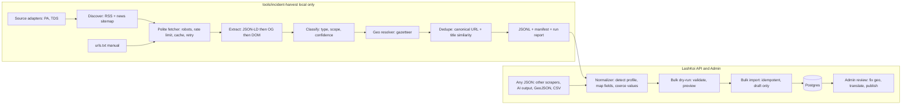

# Local news harvest to bulk incident JSON (revised)

## 1. Review of the previous plan

What it got right: local-only tool, human review before publish, place names instead of P-codes, a CLI and an admin upload path, attribution to the source.

Problems found (checked against the live sites on 2026-09-30):

- **Google News RSS as the main discovery source is fragile.** Items link to opaque redirects (`news.google.com/rss/articles/CBMi...`). To get the real publisher URL you need an unofficial decoder that Google changes without notice. Publisher feeds are more reliable (next point).
- **The publishers already provide better feeds.** Prothom Alo `/feed/` returns about 66 items with `content:encoded`, `media:content` and `media:keywords`. `news_sitemap.xml` lists about 600 recent URLs with `news:keywords`. The Daily Star `/rss.xml` returns only 8 items, so it needs section feeds or a sitemap (to confirm in the spike).
- **Structured data is available and was under-used.** Article pages on both sites include schema.org `NewsArticle` JSON-LD (headline, datePublished, image, author). This is the standard first choice for extraction, ahead of CSS selectors.
- **Relevance was assumed, not measured.** Keyword hits include many non-incidents: political statements ("চাঁদাবাজি বন্ধ করতে হবে"), opinion pieces, and national totals ("২৪ ঘণ্টায় ডেঙ্গুতে ৬ জনের মৃত্যু"). A national total cannot be placed on a map. The plan needs a scope classifier and a precision measurement.
- **No idempotency or dedupe at the database level.** Re-running the same day, or importing the same file twice, would create duplicates. The same event reported by both papers would also appear twice.
- **Copyright exposure.** Importing `og:image` and body paragraphs onto a public map republishes copyrighted content. The industry norm for aggregators is headline + short summary in your own words + link.
- **Language gap.** `titleEn`/`summaryEn` are required by `CreateIncidentRequestDto`, but Prothom Alo is Bangla-only. The plan had no policy for this.
- **"Local only" was not enforced.** The API is deployed at `lashkoi-api.vercel.app`, so a new bulk endpoint would also exist in production unless it is feature-flagged.
- **No tests or health signal.** When a site changes its HTML, the scraper fails silently.

## 2. Feasibility study

Verdict: **feasible as a human-in-the-loop curation tool**, not as an auto-publisher. Expect the tool to save most of the discovery and typing time. Judging relevance and setting the map pin stays manual for most rows.

- **Legal / robots.** Prothom Alo robots.txt allows `/` (blocks only `/api/auth/`, comments, `/story/*/element/`). Daily Star allows articles (blocks only `/core/`, `/profiles/`). Risk: low for low-volume personal curation. Mitigation: identify the bot in User-Agent, one request every 2-3 seconds per host, no full-text republishing, no hot-linked images by default.
- **Discovery.** High feasibility with publisher RSS and sitemaps (verified live). Google News RSS drops to optional "title hints". Manual URL paste remains the fallback.
- **Extraction.** High feasibility. JSON-LD `NewsArticle` exists on both sites, with OpenGraph as fallback. Risk: medium over time (layout drift). Mitigation: fixture tests plus a per-run "fields missing" count.
- **Relevance (is it a mappable incident?).** Medium feasibility. Rules with negative keywords get a usable first pass. Precision must be measured in the spike, and review stays mandatory.
- **Geolocation.** Medium feasibility at district level, low at upazila/union level. `admin_areas` has `name_en`/`name_bn` at all levels, so a gazetteer is cheap. Risks: repeated upazila names across districts, spelling variants (Chattogram/Chittagong, Cumilla/Comilla, Bogura/Bogra, Barishal/Barisal, Jashore/Jessore), and Bangla locative suffixes (ফরিদপুরে, সিলেটের). Mitigation: a variant table, suffix stripping, and accepting an upazila only when its district is also matched.
- **Translation.** Feasible with a local Ollama model at zero cost (section 13). Quality for short Bangla headlines is usable but not publish-ready, so rows stay flagged `needsReview: ["translation"]`. If Ollama is unavailable, the original text is copied and flagged.
- **Foreign JSON shapes.** High feasibility with mapping profiles and an alias table. Truly new shapes need a one-time field mapping in the admin UI, which is then saved and reused.
- **Effort (solo developer, rough).** Spike 1-2 days. MVP (Phases 1-2 below) 8-11 days. Hardening 2-3 days.
- **Operating cost.** Zero infrastructure (local Node, existing Neon DB). Daily human time: roughly 10-20 minutes for review and pinning, depending on volume.

Go/no-go gate after the spike: continue if at least half of the auto-flagged "event" rows are real mappable incidents and district resolution is right for most of those. Otherwise ship only the manual-URL path (paste link, get a pre-filled draft), which still saves typing.

## 3. Target architecture (staged ETL, industry pattern)



Principles applied:

- **Staged and re-runnable.** Each stage reads the previous stage's file, so you can re-run extraction without re-fetching. The raw HTML cache is content-addressed in `.cache/` (gitignored).
- **Idempotent end to end.** The record key is `sha256(canonicalUrl)`. Re-running a day updates rows instead of duplicating them. Importing twice results in skips.
- **Schema-first and versioned.** A single Zod schema (`schemaVersion: 1`) is shared by the CLI and the API. JSON Schema is generated from it for editors.
- **Provenance.** Every row carries source, fetch time, extractor used, matched keyword, confidence scores and parser version.
- **Human in the loop.** The API only creates drafts. Publishing requires `locationConfirmed = true`.

## 4. Harvest tool design

Package `tools/incident-harvest/` (Node 20+, TypeScript via `tsx`). Dependencies: `cheerio`, `fast-xml-parser`, `zod`, `yaml`, `p-limit`, `robots-parser`, `undici`. It runs locally, so the Vercel ESM issues from earlier do not apply.

Source adapter interface (one file per site under `sources/`):

```ts
interface SourceAdapter {
  id: 'prothomalo' | 'thedailystar';
  hosts: string[];
  language: 'bn' | 'en';
  discover(since: Date): Promise<DiscoveredItem[]>; // RSS + news sitemap
  extract(html: string, url: string): ExtractedArticle; // JSON-LD > OG > DOM
}
```

- **Prothom Alo:** discover from `/feed/` and `news_sitemap.xml`, and use `media:keywords`/`news:keywords` as extra classification signal.
- **The Daily Star:** discover from `/rss.xml` plus section feeds or a news sitemap (confirm URLs in the spike). Also check `bangla.thedailystar.net`.
- **Fetcher:** checks robots.txt, runs one request at a time per host with a 2-3 second delay, uses conditional GET (ETag/Last-Modified), backs off exponentially on 429/5xx, times out after 15 seconds, and sends `User-Agent: LashKoiHarvester/1.0 (+contact email)`.
- **URL canonicalization:** prefer `<link rel="canonical">`, strip `utm_*`/`fbclid`, lowercase the host, drop the fragment.

Keyword rules in `config/keywords.yaml`, per type: include terms (BN + EN), exclude terms, and a scope hint.

- `extortion`: include চাঁদাবাজি, চাঁদা দাবি, চাঁদা না দেওয়ায়, extortion. Exclude মতামত, সম্পাদকীয়, "বন্ধ করতে হবে", editorial, opinion.
- `dengue`: include ডেঙ্গু, ডেঙ্গুতে মৃত্যু, dengue. Mark national-total patterns (সারাদেশে, ২৪ ঘণ্টায়, nationwide) as `scope: aggregate`.
- `measles`: include হাম, হামে শিশু, measles. Exclude unrelated matches of "হাম" by requiring a word boundary or a nearby health term.
- `kidnap`: include অপহরণ, অপহৃত, মুক্তিপণ, kidnap, abduct.
- `body_found`: include লাশ উদ্ধার, মরদেহ উদ্ধার, body recovered, body found. This is a new type seeded in the migration (see section 12).

Local overrides go in `input/keywords.local.yaml` (gitignored).

Scoring per row (0-1, stored in `_harvest.scores`):

- `relevance`: keyword hits in title are weighted above hits in the body; any exclude hit applies a penalty.
- `scope`: `event` | `aggregate` | `statement`. Only `event` rows are selected for import by default.
- `geo`: 1.0 for an exact district match in the title, lower for body-only or variant matches, 0 when nothing matched.

Geo resolver (`harvest:export-areas` produces `data/gazetteer.json` from `admin_areas`):

- Normalize Bangla (Unicode NFC, strip locative suffixes -এ/-য়/-তে/-র/-ের), normalize English (lowercase, variant table).
- Match districts first. Accept an upazila only when it sits inside the matched district. Never auto-assign a union.
- Output `placeNameEn/Bn`, `placeHint`, `guessed.divisionPcode/districtPcode/upazilaPcode` and `geo` confidence. The user never types P-codes or coordinates.

Dedupe:

- Exact: same `externalId` (canonical URL hash).
- Near-duplicate (same event in both papers): same type, same guessed district, within 48 hours, and title token similarity above a threshold. These are linked as `_harvest.clusterId`; review decides whether to keep one or both.

Content policy (enforced in code, documented in README):

- Keep headline, publisher summary/description (≤ 300 chars), and `sourceUrl`. Do not store the full body in the output.
- `bodyHtml` is null by default. The admin writes their own summary.
- Images: none by default. `--with-image-url` stores the URL in `_harvest` only for reference, never in `media`.

## 5. Bulk file format

`output/YYYY-MM-DD/` (gitignored) contains:

- `candidates.jsonl`: one row per line, with streaming-friendly diffs.
- `manifest.json`: `schemaVersion`, run id, parser versions, time window, and per-stage counts.
- `report.md`: human summary (discovered, fetched, extracted, relevant, geo-resolved, duplicates, errors).

Row shape (simplified):

```json
{
  "schemaVersion": 1,
  "externalId": "sha256:9f2c...",
  "type": "dengue",
  "titleBn": "ফরিদপুরে ডেঙ্গুতে ৬ জনের মৃত্যু",
  "titleEn": null,
  "summaryBn": "...",
  "summaryEn": null,
  "placeNameEn": "Faridpur",
  "placeNameBn": "ফরিদপুর",
  "placeHint": "ফরিদপুরে ডেঙ্গুতে ৬ জনের মৃত্যু",
  "caseCount": 6,
  "sourceLabel": "Prothom Alo",
  "sourceUrl": "https://www.prothomalo.com/bangladesh/district/abc123",
  "occurredAt": "2026-09-29T10:00:00.000Z",
  "_harvest": {
    "source": "prothomalo",
    "fetchedAt": "2026-09-30T06:00:00.000Z",
    "extractor": "jsonld",
    "matchedKeywords": ["ডেঙ্গু"],
    "scope": "event",
    "scores": { "relevance": 0.9, "geo": 1.0 },
    "guessed": { "divisionPcode": "BD30", "districtPcode": "BD3029" },
    "clusterId": null,
    "needsReview": ["translation", "mapPin"]
  }
}
```

A plain JSON array of the same rows is also accepted by the admin upload, for hand-written files. The example goes in `config/bulk-incidents.example.json`.

## 6. Database changes (one migration)

On `incidents` (the entity already has `source_url varchar(512)` and `status`):

- Add `external_id varchar(80) null` with a unique index (canonical URL hash). This is the idempotency key.
- Add `location_confirmed boolean not null default true`. Existing rows stay valid. Bulk rows are always inserted with `false`, and it becomes `true` only when an admin saves the incident with real geo.
- Add `import_batch_id uuid null` referencing `import_batches(id)`.

New table `import_batches`: `id`, `created_by`, `created_at`, `source` (`cli` | `ui`), `file_name`, `row_count`, `created_count`, `skipped_count`, `error_count`, `dry_run`. The existing `incident_audit` records each created incident as usual.

## 6b. Import normalizer (makes any bulk JSON fit the project)

Problem: scraped or third-party JSON often uses different field names, nesting, date formats, languages or type labels (for example `headline`, `link`, `district`, `category: "Dengue fever"`, `date: "২৯ সেপ্টেম্বর ২০২৬"`). The import must accept these without asking you to hand-edit the file.

Pattern: **tolerant reader, strict writer**. Input is lenient and output is always the canonical row from section 5. It is implemented once, in the API (`apps/api/src/APP.BLL/services/incidents/import/`), and the CLI and admin UI both call it. There is no copy in the browser and no separate npm package.

Pipeline for each uploaded file:

1. **Parse container.** Accept a JSON array, `{ incidents | items | data | results | articles: [...] }`, JSONL, a GeoJSON `FeatureCollection` (`properties` + `geometry`), and CSV (header row). Anything else produces a clear error.
2. **Detect profile.** Score built-in mapping profiles by how many keys match, and pick the best. The user can override the choice.
   - `lashkoi-harvest-v1`: native harvester output (section 5).
   - `lashkoi-create-dto`: full `CreateIncidentRequestDto` rows, as in `config/demo-incidents.seed.json`.
   - `generic-news`: common scraper/AI shapes (title/headline, url/link, date/publishedAt, category/tags, district/location).
   - `geojson-features`: map features with properties.
   - Custom profiles saved from the admin UI (below).
3. **Map fields** using an alias table plus dotted paths. Examples:
   - `titleEn/titleBn` from `title`, `headline`, `title_en`, `title_bn`, `name`, `শিরোনাম`
   - `sourceUrl` from `url`, `link`, `href`, `source_url`, `source.url`
   - `occurredAt` from `occurredAt`, `date`, `publishedAt`, `pubDate`, `datePublished`, `time`
   - `type` from `type`, `category`, `incidentType`, `tags[0]`
   - `placeName*` from `district`, `zila`, `জেলা`, `upazila`, `location`, `place`, `area`
   - `lat/lng` from `lat/lng`, `latitude/longitude`, `location.lat`, or GeoJSON `coordinates`, which are `[lng, lat]` order
4. **Coerce values.**
   - Type synonyms (BN + EN, case-insensitive): "Dengue fever"/ডেঙ্গু becomes `dengue`, চাঁদাবাজি/"extortion racket" becomes `extortion`, abduction/অপহরণ becomes `kidnap`, লাশ উদ্ধার/"body recovered" becomes `body_found`, হাম becomes `measles`. Unknown values become an error for that row.
   - Language routing by script: text in the Bengali Unicode block (U+0980-U+09FF) goes to the `*Bn` field, other text to `*En`. The missing side follows section 13 (Ollama or copy + flag).
   - Dates: ISO, RFC 822, "29 Sep 2026", and Bangla digits and month names (২৯ সেপ্টেম্বর ২০২৬). Dates without a timezone are read as Asia/Dhaka. Future dates, or dates older than a configurable window, produce a warning.
   - Numbers: Bangla digits to ASCII for `caseCount`.
   - Text: strip HTML from summaries, collapse whitespace, trim to DTO max lengths (a warning is recorded when text is cut).
   - URLs: canonicalize, set `externalId`, and derive `sourceLabel` from the host when missing.
   - Coordinates: check against the Bangladesh bounding box (lat 20.5-26.7, lng 88.0-92.7). Auto-swap swapped lat/lng with a warning. Drop coordinates outside the box and flag `mapPin`.
   - Geo codes: keep P-codes only if they exist in `admin_areas`. Otherwise resolve from place names with the section 4 gazetteer. You never type codes.
   - Schema versions: upcasters migrate older `schemaVersion` rows to the current one.
5. **Report per row.** Returns the canonical row plus `mapped` (source path to target field), `defaulted`, `warnings`, `errors`, and `unmappedKeys` (kept under `_extra` in the batch record, never dropped silently). Errors block the row; warnings add to `needsReview`.

Endpoints (same admin guard and `ADMIN_BULK_IMPORT_ENABLED` flag):

- `POST /admin/incidents/bulk/normalize`: body `{ raw, format?, profile? | mapping? }`. Returns `{ detectedProfile, confidence, rows[], report, summary }` with no writes.
- Dry-run and import (section 7) accept the same raw input plus profile/mapping and **always normalize again on the server**. Output from the client is never trusted as-is.

Custom mapping (for a new source you hit often):

- In the admin UI, a "Field mapping" panel lists each source key with sample values next to a target-field dropdown. Pick the mappings, re-run normalize, and save them as a named profile.
- v1 stores custom profiles in a small `import_profiles` table (`name`, `mapping jsonb`, `created_by`), so the CLI can use them via `--profile <name>`.

## 7. API: `POST /api/v1/admin/incidents/bulk`

- Guarded by the existing admin JWT, plus the feature flag `ADMIN_BULK_IMPORT_ENABLED` (default `true` in `.env.local`, unset (off) on Vercel). This enforces "local only" without separate code.
- Query `?dryRun=true` validates and resolves every row and returns the preview without writing. The UI and CLI always call dry-run first.
- Header `Idempotency-Key` (batch-level) returns the stored result if the same batch is replayed. Row level: an existing `external_id` becomes `skipped: duplicate`.
- Maximum 200 rows per request, body limit about 1 MB. The CLI chunks larger files.
- Per-row processing inside its own transaction, so one bad row does not fail the batch. Response: `{ batchId, created[], skipped[], errors[{ index, externalId, code, message }] }` inside the standard envelope.
- Resolver fills required DTO fields: missing `titleEn`/`summaryEn` copied from BN (flagged), missing geo uses the guessed district centroid or the Dhaka placeholder, and `location_confirmed = false`.
- Always creates drafts. Publishing a draft through the existing update/publish path is rejected while `location_confirmed = false`. Saving the incident in the admin editor with a real division/district/pin sets it to `true`.
- Strips `_harvest` before persisting, except `externalId`, `scores` and `matchedKeywords`, which are kept in the batch record for traceability.

## 8. CLI (root `package.json`)

- `harvest:export-areas`: build the gazetteer from local `admin_areas`.
- `harvest:discover`: runs the adapters and `input/urls.txt`, then writes discovered URLs.
- `harvest:scrape`: fetch, extract, classify, geo, dedupe, then write `candidates.jsonl`.
- `harvest:run`: discover and scrape in one step (`--days 1`, `--source prothomalo`).
- `harvest:translate`: optional local Ollama translation of missing title/summary (section 13).
- `harvest:validate`: Zod check plus a report of rows that would fail the API.
- `harvest:normalize --in any.json [--profile auto|<name>] --out normalized.jsonl`: calls the local normalize endpoint, writes canonical rows and prints the report (mapped, warnings, errors, unmapped keys).
- `harvest:import`: accepts native or foreign files (normalizes automatically), runs dry-run first, prints a summary, asks for confirmation, then imports. Flags: `--min-relevance 0.6`, `--scope event`, `--target local` (default; `prod` must be passed explicitly and requires the flag to be enabled server-side).

Credentials live in `tools/incident-harvest/.env` (gitignored): `LASHKOI_API_BASE_URL`, `ADMIN_EMAIL`, `ADMIN_PASSWORD`. The CLI logs in via the existing `POST /admin/auth/login`.

Optional: a Windows Task Scheduler entry running `harvest:run` each morning. Import stays a manual command.

## 9. Admin UI

- New `AdminBulkImportPage` at `/admin/incidents/import`, linked from `AdminLayout` and the incidents list.
- Flow: upload `.json`/`.jsonl`/`.geojson`/`.csv`. The page calls normalize and shows the detected profile and confidence, plus the "Field mapping" panel if anything is unmapped or failed. It then runs dry-run automatically, then show a preview table with title, type, scope, place text, source link, confidence badges, `needsReview` badges and duplicate markers. The admin unticks rows, then clicks "Import as drafts". A link then goes to the resulting batch.
- No P-code or coordinate columns. The message reads "Location is set in the incident editor after import".
- Incidents list: add filters "Needs location" (`location_confirmed = false`) and "Import batch". The existing `IncidentForm` with `GeoCascadeSelect` and `MapPointPicker` handles the fix, and D8 district validation runs on save.

## 10. Quality, testing, observability

- **Parser fixtures:** 3-5 trimmed HTML samples per source (only meta, JSON-LD and the first paragraph, to avoid committing full articles), with golden-output tests using `node:test` or `vitest`.
- **Resolver unit tests:** spelling variants, Bangla suffixes, ambiguous upazila names, national-total headlines.
- **Normalizer fixtures:** one file per odd shape (AI-generated list, nested `data.items`, GeoJSON with `[lng, lat]`, CSV, Bangla dates/digits, swapped coordinates, unknown type, extra keys). Each has an expected canonical output and report.
- **API tests:** dry-run makes no writes, duplicate `external_id` is skipped, the publish guard rejects unconfirmed rows, and the batch limit is enforced.
- **Run report:** if the extractor fallback rate or the missing-date count jumps, treat it as a likely layout change and print a warning.
- **Precision log:** the admin's accept/reject decisions per batch are stored, so keyword rules can be tuned against real numbers.

## 11. Phased rollout

- **Phase 0, spike (1-2 days):** confirm Daily Star section feeds/sitemap, run discovery and extraction on 7 days of both sources, label about 100 rows by hand, and measure relevance and district accuracy. Go/no-go decision.
- **Phase 1, MVP harvest (3-4 days):** adapters, fetcher, extraction, keywords, gazetteer, JSONL output, validate command.
- **Phase 2, MVP import (5-7 days):** migration, import normalizer with built-in profiles, bulk endpoint with dry-run and idempotency, CLI normalize/import, admin upload page with field-mapping panel, "Needs location" filter.
- **Phase 3, hardening (2-3 days):** fixture tests, run report warnings, precision log, docs.
- **Later (optional):** more sources (bdnews24, Dhaka Tribune, Jugantor, Samakal) as extra adapters, cross-source event clustering in the UI, Ollama suggestions for scope and place (always reviewed), and an in-admin review queue that replaces file upload.

## 12. Decisions (confirmed)

- **`body_found` type: yes.** Seed a new `incident_types` row (`body_found`, "Body found" / "লাশ উদ্ধার") and add it to the DTO type list, the web type filters and the map legend. Keywords: লাশ উদ্ধার, মরদেহ উদ্ধার, body recovered, body found.
- **Bulk endpoint off in production.** `ADMIN_BULK_IMPORT_ENABLED` is `true` only in `apps/api/.env.local`. On Vercel it is left unset, and the endpoint returns 404.
- **Translation: copy and flag, plus a local Ollama model.** See section 13.

## 13. Local translation with Ollama (optional stage)

- New command `harvest:translate` runs after `harvest:scrape` and before import. It calls the local Ollama HTTP API (`http://localhost:11434/api/chat`, `format: "json"`, `stream: false`, temperature 0).
- Suggested model: `qwen2.5:7b` or `gemma3:12b` (both handle Bangla reasonably). Configured via `OLLAMA_MODEL` in `tools/incident-harvest/.env`. The model is benchmarked in the spike on about 20 real headlines.
- Scope: only the missing language for `title` and `summary` (short text). The row records `_harvest.translation = { engine: "ollama", model, at }` and keeps `needsReview: ["translation"]`, so the admin always checks machine text before publishing.
- Fallback: if Ollama is not running or returns invalid JSON, the stage copies the original text and flags the row. The pipeline never fails because of translation.
- Guardrails: a prompt that forbids adding facts, output validated with Zod (non-empty, length limit), and translations cached by text hash in `.cache/`.
- Later (optional): the same Ollama step can suggest `scope` and place names for rows with low confidence. Its output is stored only as a suggestion in `_harvest`, never as a final value.

## Out of scope (v1)

- Scraping Google Search result pages, or decoding Google News redirect links.
- Paywalled or login-only content, and non-Bangladeshi sources.
- Auto-publishing, or storing full article bodies or images.
- Running the harvester in the cloud.

## Key files to leverage

- Incident DTO and required fields: [apps/api/src/APP.Shared/dtos/incidents/CreateIncidentRequestDto.ts](apps/api/src/APP.Shared/dtos/incidents/CreateIncidentRequestDto.ts)
- Entity (`source_url`, `status`): [apps/api/src/APP.Entity/entities/Incidents.entity.ts](apps/api/src/APP.Entity/entities/Incidents.entity.ts)
- Gazetteer source (`level`, `name_en`, `name_bn`): [apps/api/src/APP.Entity/entities/AdminAreas.entity.ts](apps/api/src/APP.Entity/entities/AdminAreas.entity.ts)
- Create/audit logic to reuse: [apps/api/src/APP.BLL/services/incidents/IncidentAdminService.ts](apps/api/src/APP.BLL/services/incidents/IncidentAdminService.ts), [IncidentAuditService.ts](apps/api/src/APP.BLL/services/incidents/IncidentAuditService.ts)
- Controller: [apps/api/src/APP.API/admin-controllers/incidents/AdminIncidentsController.controller.ts](apps/api/src/APP.API/admin-controllers/incidents/AdminIncidentsController.controller.ts)
- District check on save: [apps/api/src/APP.BLL/services/boundaries/DistrictBoundaryValidationService.ts](apps/api/src/APP.BLL/services/boundaries/DistrictBoundaryValidationService.ts)
- Admin editor pieces: [apps/web/src/components/admin/IncidentForm.tsx](apps/web/src/components/admin/IncidentForm.tsx), [GeoCascadeSelect.tsx](apps/web/src/components/admin/GeoCascadeSelect.tsx), [MapPointPicker.tsx](apps/web/src/components/admin/MapPointPicker.tsx)
- Existing import pattern: [apps/api/src/seeds/seed-demo-incidents.ts](apps/api/src/seeds/seed-demo-incidents.ts), [config/demo-incidents.seed.json](config/demo-incidents.seed.json)
