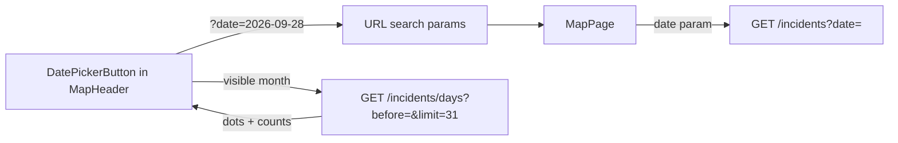

# Map date calendar (single day, no backend change)

## What already exists

- `GET /incidents` accepts `date=YYYY-MM-DD` and filters by Asia/Dhaka calendar day ([IncidentQueryService.ts](apps/api/src/APP.BLL/services/incidents/IncidentQueryService.ts), around line 120). The web client already passes `date` through ([get-incidents.ts](apps/web/src/services/get-incidents.ts)).
- `GET /incidents/days` returns `[{ date, count }]` for days that have incidents. It supports `types`, `division`, `before` and `limit` (max 90). It has no `district` filter.
- [MapPage.tsx](apps/web/src/pages/MapPage.tsx) keeps all filters in URL search params (`type`, `division`, `district`, `q`) and passes them to [MapHeader.tsx](apps/web/src/components/map/MapHeader.tsx).

## Changes

1. **Dependency:** add `react-day-picker` (v9, which pulls in `date-fns`) to `apps/web`. It provides keyboard navigation and ARIA out of the box, a `bn` locale, and `numerals="beng"` for Bangla digits. It is styled with Tailwind classes to match the dark header.

2. **Dhaka date helpers** in `apps/web/src/lib/dhaka-date.ts`:
   - `todayInDhaka()` returns `YYYY-MM-DD` via `Intl.DateTimeFormat('en-CA', { timeZone: 'Asia/Dhaka' })`.
   - `isValidDay(s)` checks the regex and that the date is not in the future.
   - `formatDayLabel(s, lang)` returns a short label ("28 Sep 2026" / "২৮ সেপ্টেম্বর ২০২৬").
   - Dates stay as strings everywhere, which avoids UTC shift bugs.

3. **Days service:** extend [get-incident-days.ts](apps/web/src/services/get-incident-days.ts) with optional `{ before, limit }` (defaults unchanged, so Storyteller and Splash keep working). Add `queryKeys.incidentDaysMonth(lang, types, division, month)` in [query-keys.ts](apps/web/src/lib/query-keys.ts).

4. **New component** `apps/web/src/components/map/MapDatePicker.tsx`:
   - The button uses the lucide `CalendarDays` icon. Its label is "All dates" or the selected day, and an `x` clears the selection.
   - The popover holds the month grid. Future days are disabled. Days with incidents get a dot and a `title` tooltip ("3 incidents").
   - When the visible month changes, it fetches `/incidents/days` with `before=<first day of next month>&limit=31`, filtered by the current type and division.
   - Footer buttons: "Today" and "Clear". The popover closes on select, Escape or an outside click.
   - On mobile it is full width under the header (the header already wraps).

5. **MapHeader:** add props `selectedDate`, `onDateChange`, and labels `allDates`, `today`, `clear`, `incidentsOnDay`. Render the picker after the district select.

6. **MapPage:**
   - Read `const date = params.get('date') ?? ''`, and ignore it if `isValidDay` fails.
   - Pass `date` into both `queryKeys.incidents(...)` and `getIncidentsGeoJson(...)`.
   - Picking a date pauses the Storyteller tour. Pressing Play clears `date`, so the two never fight over the map.
   - Empty result for a picked day: show a small notice "No incidents on {day}", in the same style as the existing error banner but neutral.

7. **i18n:** add `header.allDates`, `header.today`, `header.clearDate`, `header.incidentsOnDay`, and `map.noIncidentsOnDay` to [en.json](apps/web/src/i18n/en.json) and [bn.json](apps/web/src/i18n/bn.json).

## Behaviour notes

- The URL is shareable: `https://lash-koi.vercel.app/?date=2026-09-28&type=dengue`.
- The day dots ignore the district filter, because the days endpoint has no district param. The map itself does respect district. This is acceptable for v1; adding `district` to `/incidents/days` later is a one-line backend change.
- The health choropleth (dengue/measles, last 30 days) is unaffected by the picked date.

## Verify

- `npm run build --workspace=@lashkoi/web` passes, and lints are clean.
- Locally: pick a day that has a dot, and the map and quick list show only that day. Clear it, and all incidents return. Reloading with `?date=` keeps the filter. A future date in the URL is ignored. Switching to Bangla shows Bangla month names and digits. Storyteller pauses and resumes correctly.
