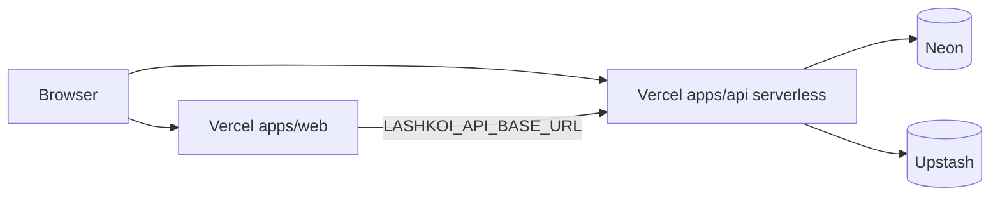

# Deploy — both on Vercel (web + API)

Two **separate Vercel projects** from the same Git repo:

| Vercel project | Root Directory | URL (example) |
|----------------|----------------|---------------|
| **lashkoi-web** | `apps/web` | `https://lash-koi.vercel.app` |
| **lashkoi-api** | `apps/api` | `https://<your-api-project>.vercel.app` |

Database: **Neon** (Postgres/PostGIS). Cache: **Upstash** (optional). See [SETUP_NEON_UPSTASH.md](./SETUP_NEON_UPSTASH.md).

**Env reference:** [env_front.md](./env_front.md) · [env_backend.md](./env_backend.md)

### Secrets & git

- **Never commit** `apps/web/.env`, `apps/api/.env.local`, or any file with real `DATABASE_URL` / `JWT_SECRET` / Upstash tokens.
- **Committed templates:** `apps/web/.env.example`, `apps/api/.env.example` (no secrets).
- **Vercel:** set the same keys in each project’s Environment Variables UI — see copy-paste blocks in the env docs above.
- **Ignored:** root [`.gitignore`](../.gitignore) — `.env`, `.env.*` (except `.env.example`), `.vercel/` from `vercel link`.



---

## Before first deploy

Run once against your **production** Neon branch (from your machine):

```bash
npm ci
# apps/api/.env.local with production DATABASE_URL
npm run api:migrate
npm run api:seed
npm run api:seed:areas
npm run api:seed:demo   # optional
```

---

## 1. API project (`lashkoi-api`)

### Vercel settings

| Setting | Value |
|---------|--------|
| **Root Directory** | `apps/api` |
| **Framework Preset** | Other (`framework: null` in config) |
| **Output Directory** | `public` (empty static dir; all routes → serverless — do not use `dist`) |
| Config file | [`apps/api/vercel.json`](../apps/api/vercel.json) |

Build installs the monorepo from `../..` and runs `nest build`. All HTTP traffic is rewritten to the single serverless function [`apps/api/api/index.ts`](../apps/api/api/index.ts) (Nest on Express). Nest output stays in `dist/` and is bundled via `includeFiles` on the function.

### API environment variables

Set in the **API** Vercel project:

| Variable | Example |
|----------|---------|
| `NODE_ENV` | `production` |
| `DATABASE_URL` | Neon pooled URL |
| `JWT_SECRET` | 32+ chars |
| `JWT_ACCESS_TTL` | `15m` |
| `JWT_REFRESH_TTL` | `7d` |
| `CORS_ORIGINS` | `https://lashkoi.vercel.app,https://your-custom-domain.com` |
| `PUBLIC_SITE_URL` | `https://lashkoi.vercel.app` (your **web** URL) |
| `SITEMAP_BASE_URL` | same as `PUBLIC_SITE_URL` |
| `UPSTASH_REDIS_REST_URL` | optional |
| `UPSTASH_REDIS_REST_TOKEN` | optional |
| `SWAGGER_ENABLED` | `true` or `false` |
| `GOVERNANCE_PARTNER_KEY` | optional |

### Smoke test

```bash
curl https://lashkoi-api.vercel.app/health
curl "https://lashkoi-api.vercel.app/api/v1/incident-types?lang=en"
```

Swagger: `https://lashkoi-api.vercel.app/swagger`

### Notes

- **Cold starts** — first request after idle may be slow (Nest + DB). Pro plan allows `maxDuration: 60` (see `vercel.json`).
- **Migrations** — not run on Vercel; use `npm run api:migrate` locally/CI against Neon.
- **Long-running server** — if you outgrow serverless, use Railway/Render with `npm run start:prod` (see bottom of this doc).

---

## 2. Web project (`lashkoi-web`)

### Vercel settings

| Setting | Value |
|---------|--------|
| **Root Directory** | `apps/web` |
| Config file | [`apps/web/vercel.json`](../apps/web/vercel.json) |

### Web environment variables

| Variable | Example |
|----------|---------|
| `VITE_API_BASE_URL` | `https://lashkoi-api.vercel.app/api/v1` |
| `VITE_SITE_URL` | `https://lashkoi.vercel.app` |
| `LASHKOI_API_BASE_URL` | `https://lashkoi-api.vercel.app/api/v1` (serverless sitemap + SEO) |

Redeploy the **web** project after changing `VITE_*` (build-time).

### What `apps/web/vercel.json` does

- SPA fallback + `/geo` static assets
- `/sitemap.xml` and `/robots.txt` → proxies to your API
- `/en|bn/incidents/:slug` → crawler meta-injection (`apps/web/api/incident-meta.ts`)

### Smoke test

```bash
curl -I https://lashkoi.vercel.app/en
curl https://lashkoi.vercel.app/sitemap.xml
```

---

## 3. Wire web ↔ API

1. Deploy **API** first; copy its `.vercel.app` URL.
2. Set API `CORS_ORIGINS` to include the **web** origin (exact scheme + host).
3. Set API `PUBLIC_SITE_URL` to the **web** origin.
4. Set web `VITE_API_BASE_URL` and `LASHKOI_API_BASE_URL` to `https://<api-host>/api/v1`.
5. Redeploy **web**.

Custom domains: e.g. `api.lashkoi.com` + `lashkoi.com` — update env on both projects.

Partner (BDCP): [BDCP_PARTNER_API.md](./BDCP_PARTNER_API.md) — add `https://bdcp.vercel.app` to API `CORS_ORIGINS` if that site calls the API from the browser.

---

## 4. Local dev

```bash
npm run api:dev    # :3000
npm run web:dev    # :5173
```

Full local files (gitignored): [env_front.md](./env_front.md) · [env_backend.md](./env_backend.md)

Quick start — copy examples to gitignored paths, edit values, then run dev:

```bash
# Git Bash / macOS / Linux
cp apps/web/.env.example apps/web/.env
cp apps/api/.env.example apps/api/.env.local
```

```powershell
# Windows PowerShell
Copy-Item apps\web\.env.example apps\web\.env
Copy-Item apps\api\.env.example apps\api\.env.local
```

```bash
npm run api:dev
npm run web:dev
```

Preview API on Vercel locally (optional):

```bash
cd apps/api
npx vercel dev
```

---

## 5. Alternative: API on Railway / Render

Same env as §1; **start command:**

```bash
npm run start:prod --workspace=@lashkoi/api
```

**Build:** `npm ci && npm run api:build`  
Point web `VITE_API_BASE_URL` at that host instead of Vercel API.
